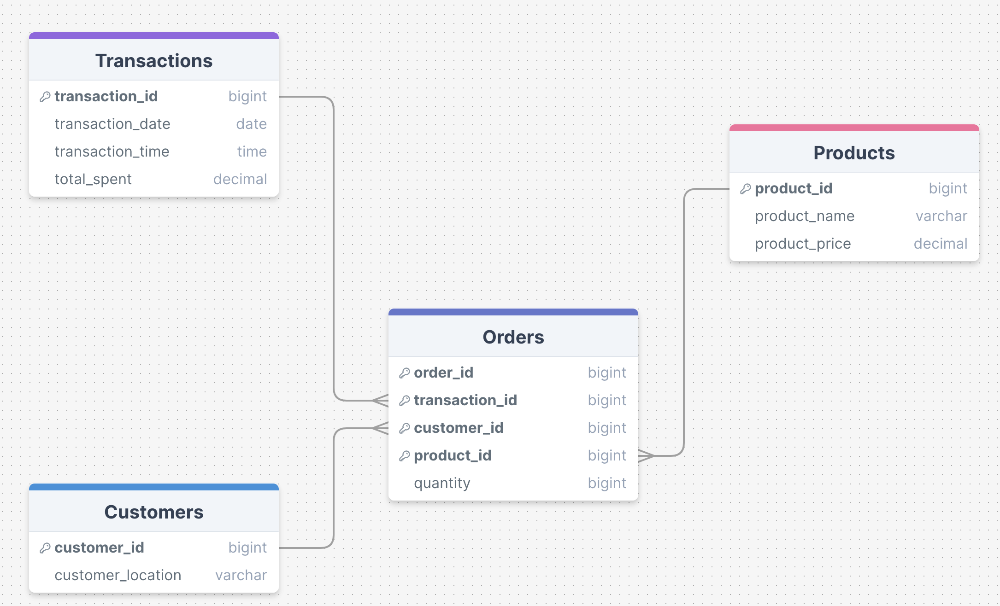
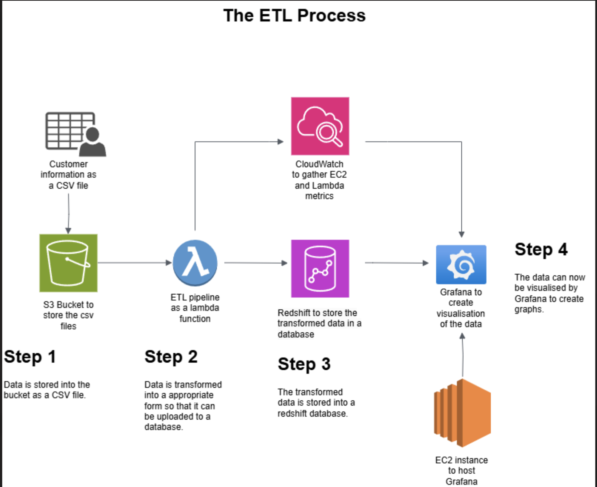

# Final-project
## About

This project is providing a service to *Super Cafe* in which we, **Nubi**, will Extract, Transform and Load data provided by the client into both a local and online database. Utilising range of AWS services such as S3, EC2, Lambda and Redshift we will be running the ETL in the cloud. We will then be presenting our findings from the data in Grafana, a data visualising tool, to provide Super Cafe with a dashboard that will provide a comprehensive insight into their business data.

## Elevator pitch:
*FOR* the super cafe owner 

*WHO* need their data data organised by:
* Sales
* Performance
* Products
* Stores

*THE* NUBI service 

*IS* a data engineering service 

*THAT* creates structure, organisation and security to build clear reports using data visualisations

*UNLIKE* manual processing of data and having separate disjointed forms of data

*OUR SERVICE* automates data organisation and visualisation offering real time insights into sales and operations. 
Our service ensures customer privacy (names, card number, etc.)


## Team Members

* Haaris H
* Byron S
* Taiwo A
* Mujtaba M

## Database Schema Model



## ETL Process Diagram



# Sprint 1 - ETL

In this sprint we complete the first stages of our project. By implementing ETL (Extract, Transform and Load) we stored data provided by the client into a Postgres SQL database.

To run ETL using files provided:

 1. Copy and Paste "Nubi_setup.sql" into adminer
 2. Run load.py

# Sprint 2

 In this sprint we have set up an S3 bucket to store our data. We then ran a Lambda function which consisted of a modfified version of our ETL from last sprint to run the process in the cloud. This ETL loads our data into Amazon Redshift where client data will be stored.

 To run ETL in AWS:

 1. Create S3 bcuket and Lambda function (Configuration details followed from class exercise)
 2. Paste Nubi_Redshift_Setup.sql (doesnt exist yet) into Redshift query to setup databse tables
 3. Run modified ETL function via Lambda to Extract from S3, Transform and Load into Redshift
 4. Data should appear in Redshift...


 # Sprint 3 

 This sprint focused on setting up a secure infrastructure and automating deployment processes. 
 Key tasks 
 - creating a dedicated security group  to restrict SSH and HTTP access to team IP addresses. 
 - Setting up an EC2 instance,installatin and  configuration with Docker to host Grafana.
 - Connections to CloudWatch and Redshift for monitoring Lambda and EC2 metrics. 
 - viusalize Sales data metrics for stakeholders.
 - automating deployments with CloudFormation and GitHub integration.(create GitHub Action and deploy via CloudFormation.)
 
 ## Security Group Setup

*Create a new security group (team-sg) in AWS console.*

- When making the security group, do this:
- Use your team name e.g. `your-team-sg`
- Limit all Inbound access to teams IP addresses only
    - For each person in your team:
        - Select `SSH` for `Type` and `My IP` for `Source` (to make a rule for port 22)
        -  Select `HTTP` for `Type` and `My IP` for `Source` (to make a rule for port 80)

## EC2 Instance Setup:

- Launch a new instance using "Amazon Linux 2023" AMI.
- Assign the your-team-sg security group to the instance.
- Download the SSH key and securely store it (do not commit to Git).

## Accessing the Instance

- SSH Connection - on your instance summary page, select Connect and copy the SSH command.
- Terminal Setup - Open a terminal in the directory containing your .pem file.
- Run -  'chmod 400 `yourname-key.pem`
- Paste the SSH command and connect.
- confirm the connection by typing yes when prompted.
- terminal prompt should change to show you are inside the instance! ready to use it.

## Docker Setup

- Use the most recent AWS "Amazon Linux 2023" machine image (AMI)
- SSH into the instance with the SSH key you downloaded. DO NOT LOSE THIS KEY!
   **DO NOT** put this in any Git folder - this would be like adding a password to git, but worse, which is **VERY BAD**
- Then to install docker inside it you need to run this:
```sh
sudo yum install docker -y
sudo service docker start
sudo usermod -a -G docker ec2-user
sudo chkconfig docker on
```
Run the following commands:The following steps are to ensure any changes you've made in Grafana are saved when you Stop/Pause your instance and Start it again.

- SSH/Connect into the EC2 instance
- Configure docker Volume ensure the Grafana Docker image is not running

`docker ps -a`  `docker stop <container-id>` `docker rm <container-id>`

- Create a docker volume `docker volume create grafana-storage`
- Verify docker volume has been created `docker volume ls`
- Run the Grafana container `sudo docker run -d -p 80:3000 --rm --volume grafana-storage:/var/lib/grafana grafana/grafana`
- Check container is running `docker ps -a`
 -Verify Grafana site is running by going to the Instance's public IP address (check the EC2 page)
- Now go to AWS and click `Stop Instance` to stop the instance
- Select your instance and click the `Actions` drop-down -> `Instance settings` -> `Edit user data`
- In the `Edit user data` page, ensure `Modify user data as text` is selected and then copy & paste the following into the text field:

```yaml
Content-Type: multipart/mixed; boundary="//"
MIME-Version: 1.0

--//
Content-Type: text/cloud-config; charset="us-ascii"
MIME-Version: 1.0
Content-Transfer-Encoding: 7bit
Content-Disposition: attachment; filename="cloud-config.txt"

#cloud-config
cloud_final_modules:
- [scripts-user, always]

--//
Content-Type: text/x-shellscript; charset="us-ascii"
MIME-Version: 1.0
Content-Transfer-Encoding: 7bit
Content-Disposition: attachment; filename="userdata.txt"

#!/bin/bash
sudo docker run -d -p 80:3000 --rm --volume grafana-storage:/var/lib/grafana grafana/grafana
--//--
```

- Click `Save`.Start your Instance again. Docker should now be running automaticallyVerify this by logging back in and running `docker ps -a`Also verify it by browsing to the Grafana site via the Instance's public IP address.

## Setup Grafana users

To create a new user login for each team member, navigate to `Server Admin --> Users --> New user` and begin creating unique users with _secure passwords_.

## Connecting Grafana to CloudWatch

 we need to connect a data source in order to generate some graphs and metrics.

- In Grafana, navigate to `Connection --> Data Sources`. Select `Add data source`, search for `CloudWatch` and select.
- Give it a name, or leave as default.
- Leave other settings as default.
- Set region to `eu-west-1`.
- Select `Save & Test`. You should see a confirmation `Data source is working`.

## Creating a Lambda metric

Graphs and metrics for our Lambda - e.g. how many time it ran, how long it took, how many errors there were.

- Create a new dashboard and add a new panel.
- Select `CloudWatch` as the query type, and `CloudWatch Metrics` as the query mode.
- Select `AWS Lambda` as the namespace, and `Invocations` as the metric name.
- Add a new Dimension. Select `Function name` as the resource and select the dimension value as your teams ETL lambda.
- Update the time query to be last 24 hours or 2/7 days if you need to go back that far to see data being graphed.


## Connecting Grafana to Redshift

- Install the "Amazon Redshift" plugin
- Add a "Redshift" datasource
- Leave the _assumed role_ blank (as it defaults to the role on EC2 instance)
- Set default region to `eu-west-1`
- Select the redshift cluster in "Cluster Identifier"
- Add your team's database user and database name
- You can now create dashboards by using the data from your Redshift database, using SQL.

# Sprint 4 

Moving into Sprint 4, we have applied all the setup from Sprint 3 and made a start on our dashboard in Grafana. By presenting data in a range of forms and structures we are able to provide Super Cafe with detials on their business and insights to answer any quetions they may need answering.

As displayed at the start, the diagrams present **sales data** and monitor our infrastructure through **EC2** and **Lambda** metrics. Across 2 dashboards, the business will be able to monitor their ETL and view a range of sales data to support business interests.